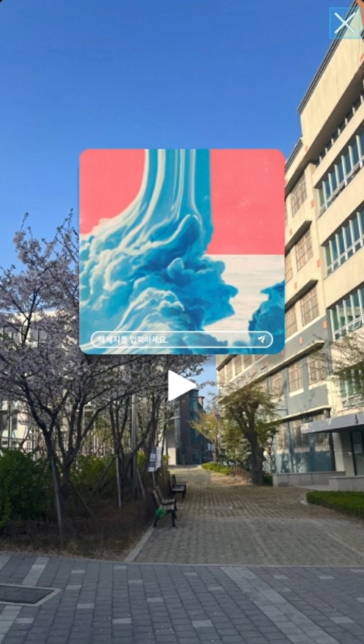
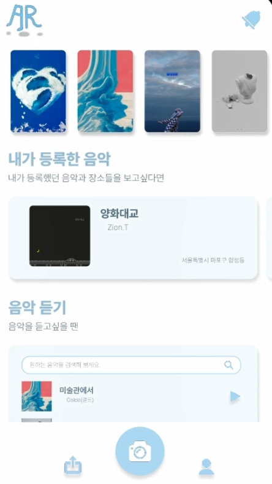
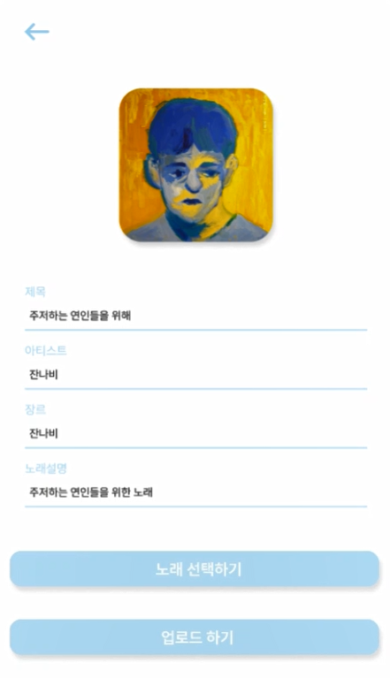

# 🌍 One Around Music (프론트엔드)

React Native를 활용한 AR 음악 공유 플랫폼의 프론트엔드 앱입니다.

---

## 📖 프로젝트 소개

AR 기술을 활용해 사용자가 음악을 공유하고, 다른 사람들과 감성을 나누는 소셜 네트워크 앱입니다.

---

## 🚀 주요 기능

- **🎵 AR 플레이어**: 공간에 떠 있는 AR 뮤직 플레이어로 감상  
- **💬 인터랙션**: 댓글, 좋아요, 공유 기능  
- **👥 팔로우 & 피드 기능**: 친구의 음악 업데이트와 이력 확인

---

## 📱 시연 화면

각 이미지를 `images/` 폴더에 저장해주세요.

### 1. 앱 실행 – AR 플레이어



📌 ‘AR 화면 캡처 이미지’ – 음악 플레이어가 AR로 나타나는 장면을 인용하세요.

---

### 2. 홈 피드 화면



📌 피드에서 친구의 음악과 반응을 확인할 수 있는 화면입니다.

---

### 3. 음악 업로드 폼



📌 파일 선택, 제목·설명 입력 폼이 포함된 화면을 캡처하세요.

---

### 4. 댓글 화면


📌 AR 위 플레이 버튼 아래에 댓글과 좋아요 버튼이 나오는 화면을 담으세요.

---

## 🏁 실행 방법

```bash
git clone https://github.com/ChoiSuJin03/one_aroundmusic_front.git
cd one_aroundmusic_front

npm install
# 또는
yarn install

# iOS 시뮬레이터 실행
npx react-native run-ios

# Android 시뮬레이터 실행
npx react-native run-android
